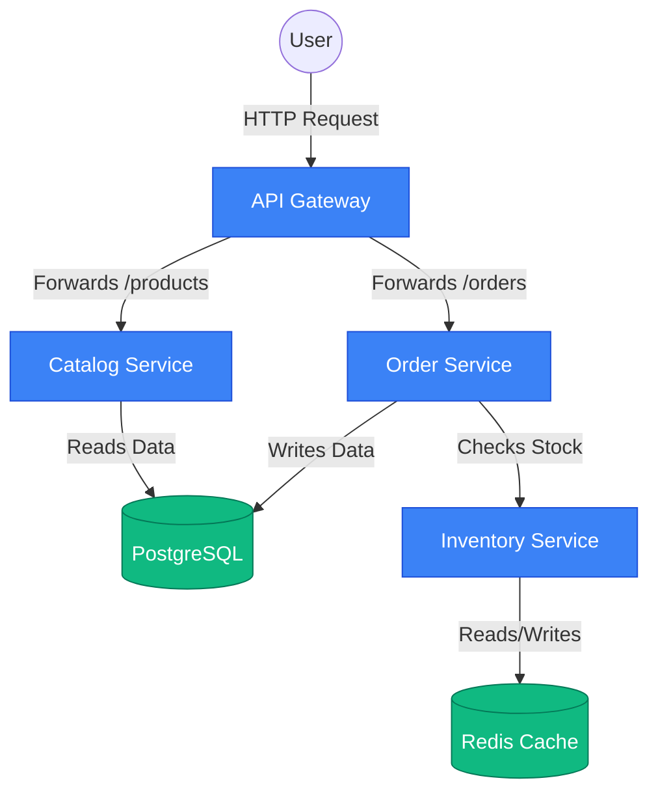

# Demo Shop (Infrastructure for Relivo)

This is a purposefully small, highly hardened, multi-service application designed to act as the "dummy infrastructure" for testing the **Relivo** SRE & Security Multi-Agent system.

---

## 1. What is a Distributed System?

Imagine you are running a real-world restaurant. 
* **A Monolith (Traditional App):** You are the only employee. You take the order, you cook the food, you wash the dishes, and you process the payment. It's easy to manage because it's just you, but if you get sick, the entire restaurant shuts down.
* **A Distributed System (Microservices):** You hire a Waiter, a Chef, a Dishwasher, and a Cashier. Everyone has a specific job. If the Dishwasher gets sick, you can still take orders and cook food. You can even hire three Chefs if the kitchen gets too busy!

In software, a **Distributed System** means taking a giant application and breaking it into small, independent pieces (Microservices) that run on completely different computers (or containers) and talk to each other over a network.

---

## 2. The Architecture

Your `demo-shop` is a textbook distributed system. It is broken into 4 distinct "employees" (services) and 2 "storage rooms" (databases).



#### Meet the Team:
1. **API Gateway (The Waiter):** The user *only* talks to the Gateway. The user doesn't know the Catalog or Order services exist. The Gateway looks at the request and decides who to send it to.
2. **Catalog Service (The Menu):** Its only job is to look at PostgreSQL and tell the user what products exist and how much they cost.
3. **Order Service (The Cashier):** The most complex service. It creates the final receipt. But before it can do that, it has to ask the Inventory Service if the item is in stock.
4. **Inventory Service (The Stockroom Manager):** Its only job is to look at Redis (an ultra-fast, in-memory database) and keep track of exactly how many items are left.

---

## 3. Hardened Distributed Features

Because in a distributed system, the network is unreliable, computers crash, and things happen at the exact same time, this application implements several enterprise-grade hardening patterns:

* **Atomic Redis Locks (Concurrency):** We use a Lua Script to reserve stock atomically. If 100 people try to buy the last 5 keyboards simultaneously, exactly 5 will succeed and 95 will fail.
* **The Saga Pattern (Distributed Transactions):** If the Order Service reserves the item in Inventory, but the PostgreSQL database subsequently crashes during the receipt creation, the Order Service executes a **Compensating Transaction** to release the stock back to the Inventory automatically.
* **Fail-Fast Timeouts:** All inter-service HTTP requests use a strict 5.0 second timeout. If Inventory dies, the Order service will not hang indefinitely and bring down the Gateway with it.
* **Pydantic Validation:** All incoming HTTP requests instantly validate input types (e.g. quantity > 0) before any complex business logic executes.

---

## 4. Endpoints

* `GET /products`
* `GET /products/{id}`
* `POST /orders` (Body: `{"product_id": 101, "quantity": 1}`)
* `GET /orders/{id}`
* `GET /health` (available on all services - checks process liveness)
* `GET /ready` (available on all services - strictly verifies database dependencies are alive)

---

## 5. Kubernetes Readiness Audit

The codebase has been 100% audited and validated for a Kubernetes rollout. 

### Configuration Matrix
All services configure routing internally via environment variables:
| Service | Variable | Current Default | Kubernetes Implementation | Required |
| --- | --- | --- | --- | --- |
| Gateway | `CATALOG_URL` | `http://catalog-service:8000` | ConfigMap | Yes |
| Gateway | `ORDER_URL` | `http://order-service:8000` | ConfigMap | Yes |
| Catalog | `DATABASE_URL` | `postgresql://postgres...` | Secret | Yes |
| Order | `DATABASE_URL` | `postgresql://postgres...` | Secret | Yes |
| Order | `INVENTORY_URL` | `http://inventory-service:8000` | ConfigMap | Yes |
| Inventory | `REDIS_HOST` | `redis` | ConfigMap | Yes |

### Resource Requirements (Learning Cluster Size)
```yaml
resources:
  requests:
    cpu: "50m"
    memory: "64Mi"
  limits:
    cpu: "250m"
    memory: "128Mi"
```

### Required Kubernetes Resources
* **Namespace**: `relivo-demo`
* **Deployments**: `gateway`, `catalog-service`, `order-service`, `inventory-service`
* **Services**: 6x ClusterIP services, 1x NodePort for the Gateway.
* **ConfigMap**: For Environment variables & PostgreSQL `init.sql`.
* **StatefulSet & PVC**: For PostgreSQL. (Redis can be deployed as a standard Deployment for MVP).

### Failure Scenarios (For Relivo AI Investigation)
| Trigger | Expected behavior | Kubernetes signal | Log signal | Future Relivo signal |
| --- | --- | --- | --- | --- |
| **Kill Catalog Pod** | 502 Bad Gateway from Gateway | Pod terminating | Gateway: `catalog_request_failed` | Span error, HTTP 502 spike |
| **Kill Redis Pod** | 503 from Inventory. Order rolls back. | Pod terminating | Inventory: `readiness_check_failed` | Loki json parse `inventory_reservation_failed` |
| **OOMKilled** | Pod forcefully restarted by kubelet | `OOMKilled` event | Process abruptly ends | Kube State Metrics `reason=OOMKilled` |
| **Invalid Product ID** | DB FK violation, stock rolls back | None (Application layer) | Order: `order_creation_failed_fk` | Metric: High 400x error rate |

---

## 6. How to Run Locally (Docker Compose)

```bash
docker compose up --build -d
```
The API Gateway will be available at `http://localhost:8000`.

To tear down completely:
```bash
docker compose down -v
```
